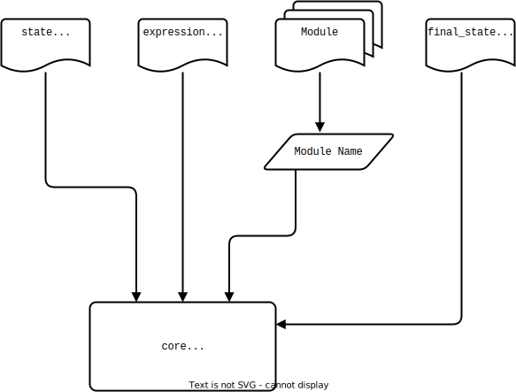
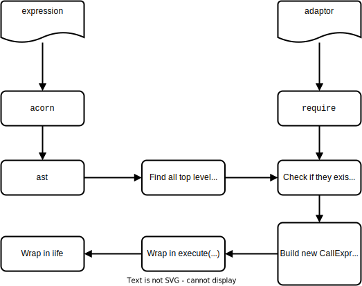

# History of Core

## How core works

OpenFn [`core`](https://github.com/OpenFn/core) is an npm module,
that both transpiles and executes a job based on the following inputs:

- A state file
- An adaptor path or module name
- An output path for "final state"



## Compilation

The first thing that core does is try to compile an expression.
Since we allow users to write function calls
(without having to write require or import statements),
we have to transpile the code to be able to reference the adaptor functions.



The process outlined above would result in the transformation shown below:

**Input**

```js
fn((state) => {
  return { ...state, counter: 1 };
});

fn(({ counter, ...rest }) => {
  return { ...rest, counter: counter + 1 };
});
```

**Output**

```js
fn((state) => {
  console.log(state);
  return state;
})(function () {
  return execute(
    fn((state) => {
      return { ...state, counter: 1 };
    }),
    fn(({ counter, ...rest }) => {
      return { ...rest, counter: counter + 1 };
    }),
    fn((state) => {
      console.log(state);
      return state;
    })
  )(state);
})();
```

The execute function is an async reducer (using vanilla promises,
as async/await and generators were in Stage 0 at the time of implementation).
This pattern allows users to write code that ‘feels’ synchronous but is
executed asynchronously.

## Execution

The execution environment ties all the work together.


It’s important to note that code is executed in a sandboxed environment,
where the vast majority of NodeJS root functionality is not available.
We also check in the compilation step that function calls that are not in
the ‘scope’ of our sandbox and throw errors in these cases.
