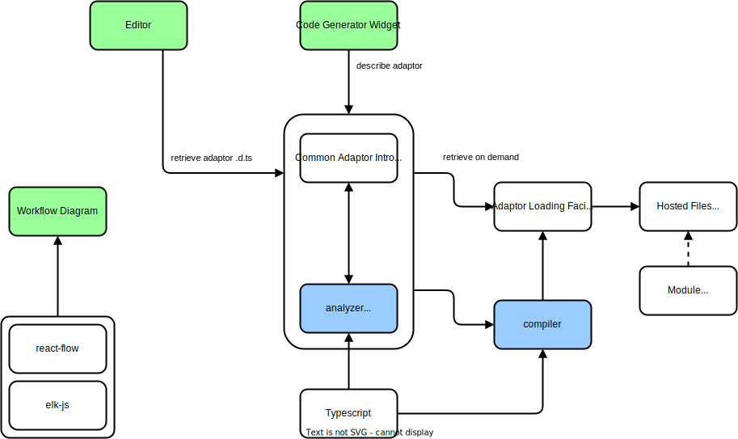

Kit Components
==============

## Workflow Diagram

See [here](../../packages/workflow-diagram/)

## Editor

## Code Generator Widget

## Analyzer

See [here](../../packages/compiler/)

## Compiler

Produce transpiled/transformed expressions

To be used from the worker to compile a job (or set of jobs) in the required
structure.

Would contain all the transforms, and the helpers borne from creating the 
transforms.
