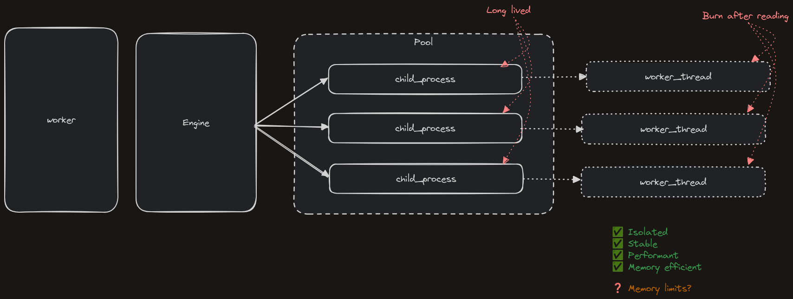

## Multi-process engine

A runtime engine which runs multiple jobs in worker threads.

A long-running node service, suitable for integration with a Worker, for executing workflows.

# Architecture

The engine runs in the main process and exposes an `execute` function, which can be called by some wrapping service (ie, the Lightning Worker).

The engine maintains a pool of long-lived child processes. For every `execute` call, the engine will pick an idle child process from the pool and execute the workflow within it.

Inside the child process, we actually execute the runtime inside a worker thread. Each child process has exactly one worker, which is created on demand and destroyed on completion.

So the process tree looks a bit like this:

```
-- main thread (execute, compile, autoinstall)
 -- child_process (spawn worker)
  -- worker_thread (@openfn/runtime)
```

Pooled child-processes are lazily spawned. If a worker never needs to run more than one task concurrently, it will only have one child process.



This architecture has several benefits:

- Each run executes in a clean sandbox inside a worker_thread /inside/ a child process. A double-buffered sandbox.
- The child process can always control the thread, even if the thread locks the CPU, to shut it down
- If the worker thread blows its memory limit, other runs will be unaffected as they are in different child processes

At the time of writing, compilation and autoinstall are run on the main thread - not in the child process.

## Usage

The Engine runs Workflows or Execution Plans. A plan MUST have an id.

Note: An Execution Plan is NOT the same as a Lightning run, although there is a 1:1 mapping between them.

Instantiate a new Engine:

```
import createEngine from '@openfn/engine-multi';
import createLogger from '@openfn/logger';

const engine = await createEngine({
  repoDir: '/tmp/openfn/engine-repo', // this is where modules are autoinstalled to
  logger: createLogger('ENGINE', { level: 'debug' }) // control log output
})
```

The createEngine function is asynchronous. It will validate that it is connected to a valid dedicated worker file before reporting for duty. The packaged Engine should do this automatically, but it does require an await.

Execute a job:

```
engine.execute(plan)
```

`execute` returns an event emitter which you can listen to:

```
engine.execute(plan).on('workflow-complete', (event) => {
  const { state, duration } = event;
  console.log(`Workflow finsihed in ${duration}`ms)
})
```

You can also call the `listen` API to listen to events from a particular workflow. Listen needs a workflow id and an object of events with callbacks:

```
engine.listen(plan.id, {
  'workflow-complete', (event) => {
    const { state, duration } = event;
    console.log(`Workflow finsihed in ${duration}`ms)
  }
});
engine.execute(plan)
```

For a full list of events, see `src/events/ts` (the top-level API events are listed at the top)

## Module Loader Whitelist

A whitelist controls what modules a job is allowed to import. At the moment this is hardcoded in the Engine to modules starting with @openfn.

This means jobs cannot do `import _ from 'lodash'`.

## Adaptor Installation

The engine has an auto-install feature. This will ensure that all required adaptors for a workflow are installed in the local repo before execution begins.

Blacklisted modules are not installed.

You can pass a path to local repo dir through the `repoDir` argument in `createEngine`. If no path is provided, it will use a default value (see the logs).

## Resolving Execution Plans

An ExecutionPlan supports lazy-loading of state objects and configuration credentials. If either of these values appears as a string, the Engine will try to resolve them to object values.

The Engine cannot do this itself: you must pass a set of resolve functions. These can do whatever you like (a typical use-case is to call up to Lightning). Pass resolvers to the execute call:

```
const resolvers = {
  credential: (id: string) => lightning.loadCredential(id),
  dataclip: (id: string) => lightning.loadState(id),
};
engine.execute(plan, { resolvers });
```

Initial state and credentials are at the moment pre-loaded, with a "fully resolved" state object passed into the runtime. The Runtime has the ability to lazy load but implementing lazy loading across the worker_thread interface has proven tricky.
