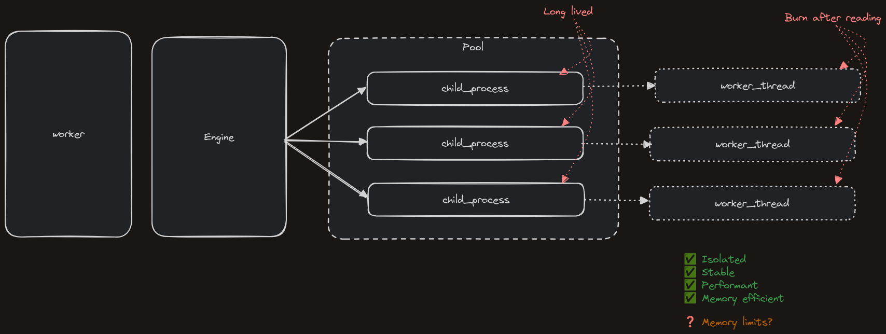

## Multi-process engine

A runtime engine which runs multiple jobs in worker threads.

A long-running node service, suitable for integration with a Worker, for executing workflows.

# Architecture

The engine runs in the main process and exposes an `execute` function, which can be called by some wrapping service (ie, the Lightning Worker).

The engine maintains a pool of long-lived child processes. For every `execute` call, the engine will pick an idle child process from the pool and execute the workflow within it.

Inside the child process, we actually execute the runtime inside a worker thread. Each child process has exactly one worker, which is created on demand and destroyed on completion.

So the process tree looks a bit like this:

```
-- main thread (execute, compile, autoinstall)
 -- child_process (spawn worker)
  -- worker_thread (@openfn/runtime)
```

Pooled child-processes are lazily spawned. If a worker never needs to run more than one task concurrently, it will only have one child process.



This architecture has several benefits:

- Each run executes in a clean sandbox inside a worker_thread /inside/ a child process. A double-buffered sandbox.
- The child process can always control the thread, even if the thread locks the CPU, to shut it down
- If the worker thread blows its memory limit, other runs will be unaffected as they are in different child processes

At the time of writing, compilation and autoinstall are run on the main thread - not in the child process.

## Usage

The Engine runs Workflows or Execution Plans. A plan MUST have an id.

Note: An Execution Plan is NOT the same as a Lightning run, although there is a 1:1 mapping between them.

Instantiate a new Engine:

```
import createEngine from '@openfn/engine-multi';
import createLogger from '@openfn/logger';

const engine = await createEngine({
  repoDir: '/tmp/openfn/engine-repo', // this is where modules are autoinstalled to
  logger: createLogger('ENGINE', { level: 'debug' }) // control log output
})
```

The createEngine function is asynchronous. It will validate that it is connected to a valid dedicated worker file before reporting for duty. The packaged Engine should do this automatically, but it does require an await.

Execute a job:

```
engine.execute(plan)
```

`execute` returns an event emitter which you can listen to:

```
engine.execute(plan).on('workflow-complete', (event) => {
  const { state, duration } = event;
  console.log(`Workflow finsihed in ${duration}`ms)
})
```

You can also call the `listen` API to listen to events from a particular workflow. Listen needs a workflow id and an object of events with callbacks:

```
engine.listen(plan.id, {
  'workflow-complete', (event) => {
    const { state, duration } = event;
    console.log(`Workflow finsihed in ${duration}`ms)
  }
});
engine.execute(plan)
```

For a full list of events, see `src/events/ts` (the top-level API events are listed at the top)

## Memory Limits

The engine enforces two memory limits on each run:

**Heap limit** (`memoryLimitMb`): sets V8's max old space size on the child process (and the worker thread's resource limits). If a run blows this, V8 aborts and the engine reports an OOMError. This only bounds the JavaScript heap - buffers and other native allocations don't count towards it.

**cgroup limit** (`cgroupMemoryLimitMb`): a hard ceiling on the child process's total memory (including native allocations), enforced by the kernel through a cgroup v2 leaf. Each pooled child process is placed in its own cgroup under `cgroupParent` with `memory.max` set and swap disabled. If a run exceeds the ceiling, the kernel OOM-kills the child; the engine detects this from the cgroup's `memory.events` and reports an OOMError.

The heap limit should sit below the cgroup limit, so that GC pressure kicks in first. The cgroup is a backstop for native (off-heap) memory, which the heap limit can't see.

An OOMError carries a `source` property (`'heap'` or `'cgroup'`) saying which limit was breached.

### cgroup setup

The engine never provisions the cgroup hierarchy itself. The contract is that the worker process is **started inside** a writable, delegated cgroup v2 subtree; the engine then creates one leaf per child process within it. By default `cgroupParent` is the cgroup the worker was started in (read from `/proc/self/cgroup`), which makes the common environments work without configuration:

| Environment         | Setup required                                                                                                                                                                                                                                                   |
| ------------------- | ---------------------------------------------------------------------------------------------------------------------------------------------------------------------------------------------------------------------------------------------------------------- |
| Docker / K8s        | Nothing to create - container processes are born in the container's cgroup. But the cgroup mount must be writable: unprivileged Docker mounts `/sys/fs/cgroup` read-only, so enforcement needs `--privileged` (or Podman, which mounts it read-write by default) |
| systemd host        | A unit with `User=openfn` and `Delegate=memory` - systemd creates the cgroup, chowns it to the user and starts the worker inside it                                                                                                                              |
| Manual (no systemd) | As root: `mkdir` the cgroup and `chown` the dir, its `cgroup.procs` and `cgroup.subtree_control` to the worker user; then a root launcher writes its own pid into `cgroup.procs` before dropping privileges and `exec`ing node                                   |
| Local dev           | Nothing - your cgroup isn't writable, so the engine warns once and falls back to heap-limit-only                                                                                                                                                                 |

If the contract isn't met (macOS, cgroup v1, no writable cgroup), the engine logs a warning once and falls back to heap-limit-only behaviour. All cgroup writes are confined to the delegated subtree: on first use the engine moves its own process into a `leader` leaf (cgroup v2 forbids delegating controllers from a populated cgroup) and enables the memory controller for its leaves.

`cgroupParent` can be overridden, but pointing the worker at a subtree it wasn't started in generally requires root: the kernel only allows migrating a process if the writer has write access to the common ancestor's `cgroup.procs`.

The ws-worker enables cgroup enforcement by default, with `run-memory + 128`mb of headroom for native allocations. Pass `--cgroup-memory 0` (or `WORKER_ENABLE_CGROUP_ENFORCEMENT_MEMORY_MB=0`) to disable it explicitly.

## Module Loader Whitelist

A whitelist controls what modules a job is allowed to import. At the moment this is hardcoded in the Engine to modules starting with @openfn.

This means jobs cannot do `import _ from 'lodash'`.

## Adaptor Installation

The engine has an auto-install feature. This will ensure that all required adaptors for a workflow are installed in the local repo before execution begins.

Blacklisted modules are not installed.

You can pass a path to local repo dir through the `repoDir` argument in `createEngine`. If no path is provided, it will use a default value (see the logs).

## Resolving Execution Plans

An ExecutionPlan supports lazy-loading of state objects and configuration credentials. If either of these values appears as a string, the Engine will try to resolve them to object values.

The Engine cannot do this itself: you must pass a set of resolve functions. These can do whatever you like (a typical use-case is to call up to Lightning). Pass resolvers to the execute call:

```
const resolvers = {
  credential: (id: string) => lightning.loadCredential(id),
  dataclip: (id: string) => lightning.loadState(id),
};
engine.execute(plan, { resolvers });
```

Initial state and credentials are at the moment pre-loaded, with a "fully resolved" state object passed into the runtime. The Runtime has the ability to lazy load but implementing lazy loading across the worker_thread interface has proven tricky.

## Note on Debugging

Debugging in the engine can be really tricky.

First there's the problem that a lot of code runs inside a worker thread in a child process, which is hard to get a breakpoint into (at the time of writing I haven't managed to do it).

But also, any console.log statements inside the inner thread will get consumed by the adaptor logger and won't go to stdout.

As a workaround to this, use console.debug inside the thread to print to stdout. This is not bound to the adaptor logger.
